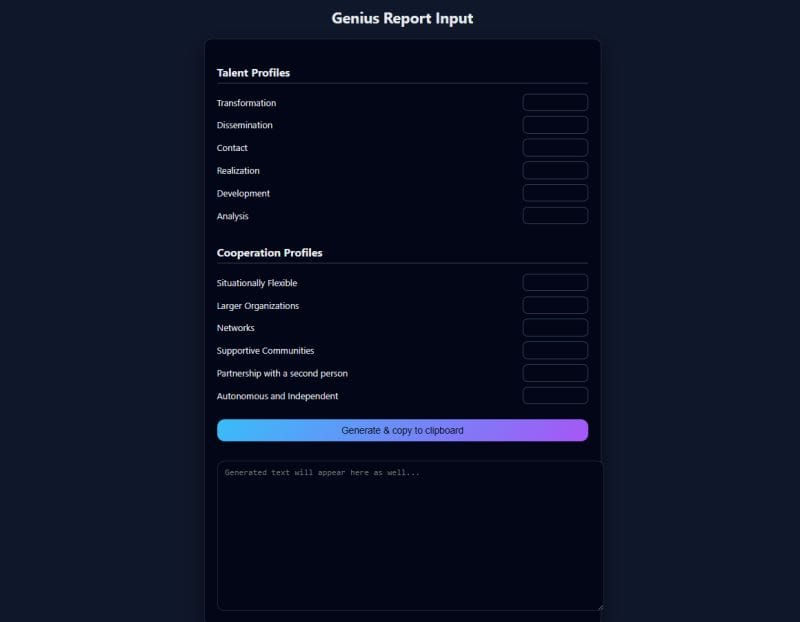

I use Zoom meetings to explore people's passions and connect their interests with their Genius Report profile. The preparation process was becoming cumbersome when generating text versions of Genius Reports.

To fix it, I turned to ChatGPT and spent just 10 minutes explaining what I needed: a simple HTML/JavaScript form where I can rapidly enter Genius Report Talent & Cooperation profile values (1–100), tab through each field, hit Enter, and have the formatted result instantly copied to my clipboard.

After ChatGPT generated the code, I saved it as an HTML file in Google Drive and bookmarked it in Chrome for quick access during sessions. The tool functions seamlessly, allowing me to paste clipboard contents into my custom GPT during meetings.

The workflow enables immediate interpretation of how a person's Talent and Cooperation profiles manifest when they're operating optimally.

Ten minutes of building. Ongoing time saved every session.
