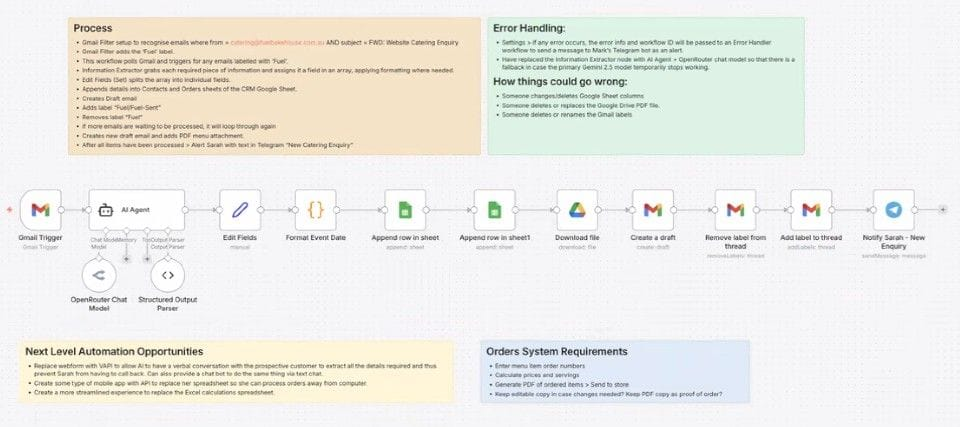

Sarah manages catering requests for Fuel Bakehouse. Every quote request followed the same five-step manual process: extract customer details from email, populate a spreadsheet, generate a quote in Excel, fill in an email template, attach the PDF, and send it. She was doing this 6 times a day, 6 days per week.

I met Sarah at Dale Beaumont's AI in Business seminar. A month later, I had something built for her.

## What I Built

An automation workflow that handles most of it. The moment an email arrives, it:

1. Extracts the customer details
2. Writes them into her spreadsheet
3. Generates the email
4. Attaches the menu PDF
5. Alerts Sarah to review, attach the quote, and send

## The Technical Stack

- **Gmail filter + label** to detect incoming quote requests the moment they arrive
- **n8n on a DigitalOcean VPS** ($6/month) triggered on that label
- **AI Agent** to extract customer details from the email and write them into the right columns in Google Sheets
- **Code nodes** to format dates correctly before insertion
- **Auto-generated email**: subject, body, dates, menu PDF attached, addressed to the customer
- **Label update** to mark emails as processed
- **Telegram alert** to Sarah so she can review, generate the quote, attach it, and send
- **Error handler** that fires a Telegram message if anything breaks

## The Result

5 minutes saved per quote request.  
6 requests a day × 6 days a week = **30 minutes daily, 15 hours a month** back in her pocket.  
Running cost: **$6/month**.

## The Lesson

I used to build n8n workflows node by node. Now I use Claude Code to build them in a fraction of the time.

If you've mapped out an online process clearly enough that someone new could follow it — AI can be trained to do it too.

With full website access, this project could have expanded to include a Voice AI agent, auto-generated quotes, and a custom order management app. That's the next conversation.
