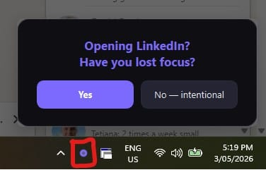
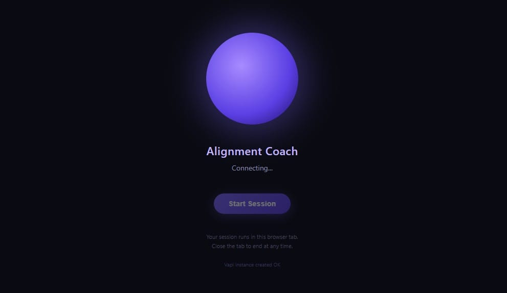

I struggle with inconsistent focus. On distraction-prone days, I waste significant time unless I catch myself early. My primary symptoms: daydreaming, or spending extended periods on YouTube, LinkedIn, or Facebook.

So I built something to interrupt the pattern.

## What It Does

A locally-running screen monitor application with two core functions:

- Detects screen inactivity exceeding 5 minutes and displays "Have you lost focus?"
- Alerts when accessing specified distraction websites
- Configurable: monitored sites, trigger timing, and messaging are all adjustable

The app functions as an intentional interruption — forcing a conscious decision instead of losing hours to distraction.

## How I Built It

I created it using Claude Code. It monitors screen activity and triggers alerts based on the conditions above.

## The AI Experiment That Didn't Work

My initial approach: a "Yes" response to the alert triggered an AI voice agent call via VAPI offering coaching.

Problem: the 11 cents/minute cost created pressure that actually hindered thinking rather than helping it.

## Three Alternatives I Considered

1. Implement walkie-talkie-style interaction requiring "over" or "thank you" to trigger AI responses
2. Build an n8n-based AI agent sending Telegram messages for asynchronous responses
3. Skip AI integration entirely using a mental state mapping system

## What I Actually Chose

Option 3. I mapped identifiable mental states to specific corrective actions:

- Murky mind
- Scattered mind
- Bored
- Restless
- Tired
- Stuck
- Chasing certainty
- Overwhelmed

Each state has a corresponding action. No AI required.

Just because I *can* use AI doesn't mean I *should*.

The app includes comprehensive Settings for customising question text, idle timing thresholds, and monitored applications.
