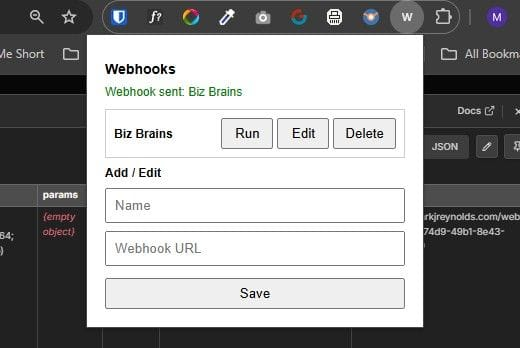

I recently developed a Chrome extension using ChatGPT, completing the initial build in approximately 45–60 minutes. The project came out of my work with n8n workflows and a RAG solution called BizBrains.

## What I Built

An extension that lets me trigger n8n workflows manually via webhooks — eliminating the need for continuous polling of data sources like Coda Tables or Gmail inboxes.

I collaborated with ChatGPT to produce vanilla, configurable code across three files: `manifest.json`, `popup.html`, and `popup.js`.

## Testing Process

1. Created a folder containing the three generated files
2. Loaded the extension into Chrome via `chrome://extensions/`
3. Enabled Developer Mode and selected "Load Unpacked"
4. Added the folder to Chrome
5. Configured webhook names and URLs through the extension menu
6. Executed webhooks by clicking "Run"

## Three Iterations

It wasn't clean first time:

- **Version 1:** Icons displayed as corrupted text
- **Version 2:** Caused complete Chrome crashes
- **Version 3:** Functioned successfully

Each refinement came through visual feedback and iterative prompting with ChatGPT.

## Why It Matters

The extension lets clients trigger workflow executions on demand rather than adhering to predetermined polling intervals. This is particularly valuable for knowledge ingestion systems that need immediate updates when new documents are added.

**Update (15/04/2026):** The "Instant Webhook" extension is now available on the Chrome Web Store.
