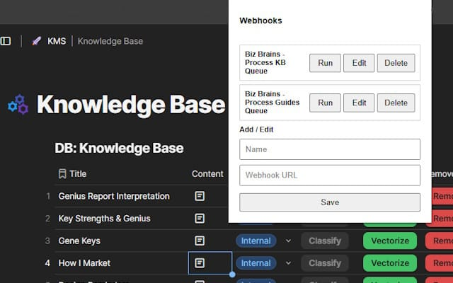

I needed a way to trigger my n8n workflows on demand without waiting for scheduled polling. So I built a Chrome Extension to do it.

## What It Does

A browser tool that lets you trigger n8n webhooks with a single click. No payload required. No waiting for the next scheduled polling interval. Just click and run.

## The Problem It Solves

Development cycles used to require waiting for scheduled polling intervals to activate workflows. That's fine in production — but painful during development and testing, and frustrating for clients who need to trigger something immediately when a new document is added.

**The benefit:** Development and testing are now instant. Clients can trigger workflows whenever they need to instead of waiting for the next scheduled run.

## Use Cases

- Trigger n8n to retrieve the latest updates from Coda tables
- Force a re-check of Google Drive files immediately after uploading
- Run any webhook-based workflow on demand during development

## Get It

The extension is available on the [Chrome Web Store](https://chromewebstore.google.com/detail/instant-webhook/pcamfcoiicffjjgfkjgnklhkafaolnjh).

It was built using ChatGPT — you can read about [the build process here](/posts/i-built-a-chrome-extension-with-chatgpt-in-under-an-hour/).
