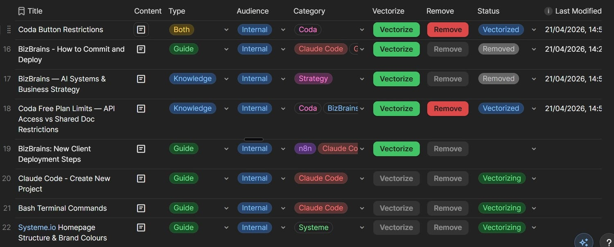
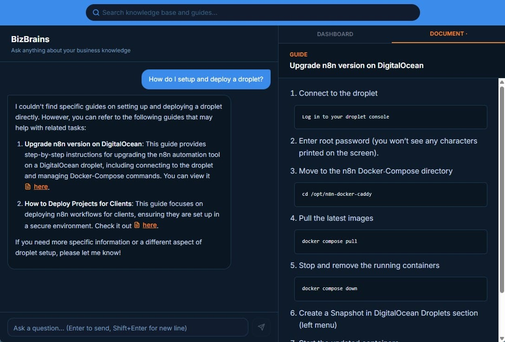

I was drowning in scattered files. Google Drive, PCloud, Documents, Coda, Keep. My filing systems would degrade from organised to chaotic after abandoning various projects, creating significant retrieval challenges.

So I built BizBrains — a self-managing knowledge base where a structured table acts as the remote control for everything.

## The Core Idea

Most RAG implementations passively store vectorised content without tracking or removal. Add a document, it gets vectorised. Done. But what happens when you update a document? Or delete it? Most systems leave orphaned data in the vector store.

BizBrains V1 used a Google Sheet to track documents alongside their titles, descriptions, tags, and categories. When PDFs were added to a specific folder, an n8n workflow vectorised them and stored them in Supabase. Changing a document's status to "Remove" automatically deleted its chunks from the vector store.

## BizBrains V1 Architecture

- **Document Tracking:** Google Sheet managing vectorisation status
- **Ingestion:** PDFs added to Google Drive folder, processed via n8n workflow
- **Metadata:** Title, description, tags, category tracked per document
- **Removal:** Status column automation for chunk deletion from Supabase
- **Retrieval:** Cohere Reranker checking against metadata for accuracy

## BizBrains V2 — Rebuilt with Claude Code

In April 2026, I used Claude Code to recreate the system in one week, consolidating from six workflows to four. The Coda table now serves dual purposes: document source and workflow controller.

**Additional V2 features:**

- **Document Types:** Knowledge documents are chunked and vectorised; Guides are stored whole with metadata-only vectorisation, returning links to original documents
- **Audience Segmentation:** A column for future internal/external sharing control
- **User Interface:** Coda buttons enabling status changes; [Instant Webhook Chrome Extension](/posts/instant-webhook-chrome-extension/) triggering n8n workflow checks
- **Frontend:** Query interface for searching the vector store

## Roadmap

- **Internal Tags System:** Using `<int></int>` tags to redact sensitive content in publicly shared documents — visible only to authenticated users
- **User Authentication:** Required for delineating internal vs external access
- **Online Table Migration:** Moving the Coda table into the frontend after authentication
- **Folder Tree View:** Hierarchical metadata field for document organisation
- **External File Vectorisation:** Supporting DOCX, Google Slides by vectorising URLs as metadata while files remain in their original locations
