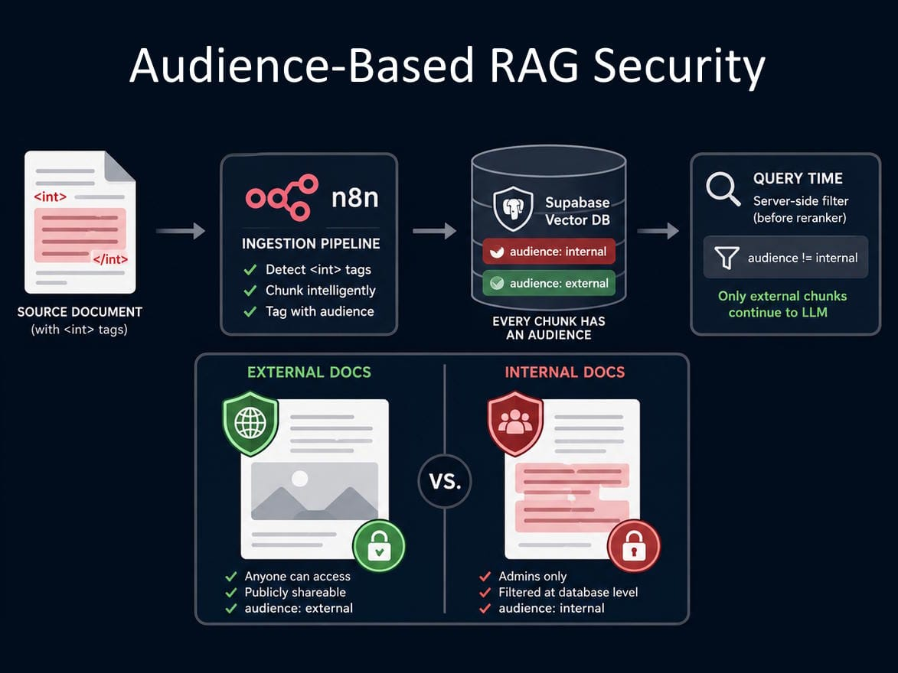
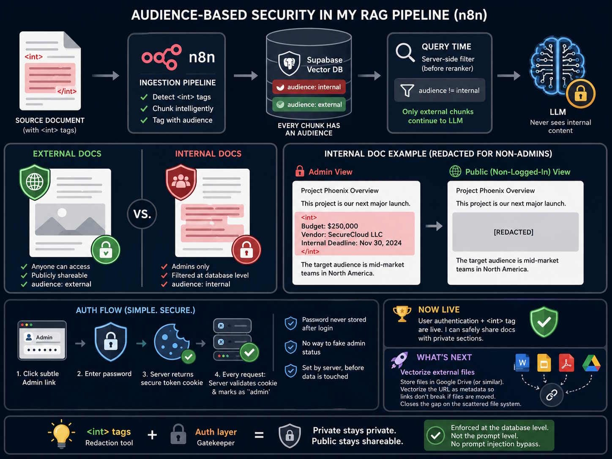

I needed to share a public knowledge base while protecting internal-only content. The obvious approach — maintaining duplicate documents — creates a maintenance nightmare and guarantees drift.

So I built a single-source solution instead.

## The Problem

One document. Two audiences. How do you serve different content from the same source without duplicating the document or risking exposure?

## The Solution: Inline `<int>` Tags

I developed a tagging system where `<int></int>` tags mark sensitive sections within a document. The approach automatically segregates content into external and internal chunks during vectorisation.

- Unauthenticated users see only public material
- Administrators access everything
- No duplicate documents, no accidental exposure

## Technical Implementation

**Core Mechanism:**

The solution integrates audience-based security into an n8n RAG pipeline. Tagged private content generates separate chunks marked with `audience: internal` metadata in Supabase. Public content receives `audience: external` tags.

During queries, the database filters results *before* the language model processes them. This prevents prompt injection attacks because filtering occurs server-side — not in the prompt.

**Authentication:**

A subtle admin link gates access via password. Upon login, the server generates a secure token stored in cookies — never the password itself. Server-side validation marks authenticated requests before data retrieval, preventing user manipulation.

## Try the Demo

You can test the system at the BizBrains web front-end:

1. Search for "Reauthorizing Google accounts?"
2. Observe how the system retrieves information with source links
3. Examine source documents in the viewer

## Roadmap

Next: vectorising external files (DOCX, Google Slides, PDFs) while maintaining original formats through URL-based metadata storage.
